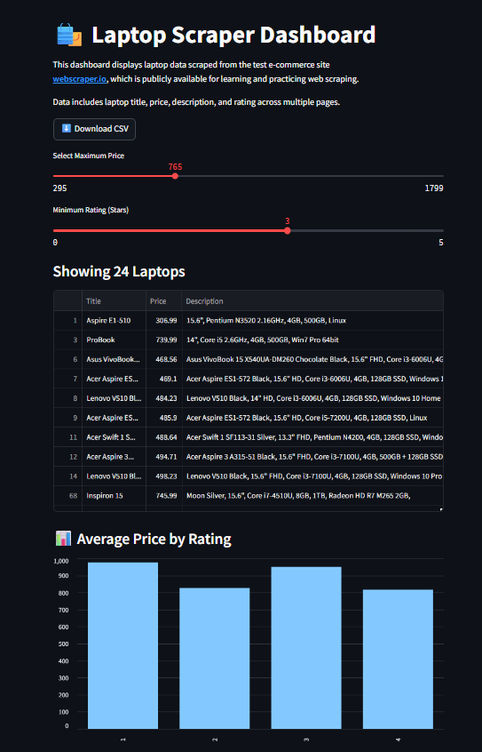

# 🛍️ Laptop Scraper Dashboard

A beginner-friendly mini project that scrapes laptop product listings from [webscraper.io](https://webscraper.io/test-sites/e-commerce/static/computers/laptops), stores them in a CSV file, and displays them in an interactive dashboard built using **Streamlit**.

---

## 📌 Project Overview

This project demonstrates:
- ✅ Web scraping using `requests` and `BeautifulSoup`
- ✅ Data storage in CSV format using `pandas`
- ✅ Interactive data visualization with `Streamlit`
- ✅ Ethical scraping using a publicly available practice site

---

## 📂 Features

- 🕸️ Scrapes product data like title, price, description, and rating
- 📄 Saves data into `laptops_combined.csv`
- 🎛️ Streamlit app with filters (price and rating)
- 📊 Bar chart for average price by rating
- 📥 CSV download option
- 🌐 Clear mention of data source (webscraper.io)

---
## 🧾 Files in This Project

| File/Folders           | Description                                |
|------------------------|--------------------------------------------|
| `Scraper.ipynb`        | Jupyter notebook to scrape and save data   |
| `laptops_combined.csv` | Scraped data in CSV format                 |
| `app.py`               | Streamlit dashboard script                 |
| `README.md`            | This documentation                         |
| `LaptopScraperDashboard.png` | Dashboard screenshot                |

---

## 🔗 Data Source

All data used in this project is from:  
**[https://webscraper.io/test-sites/e-commerce/static/computers/laptops](https://webscraper.io/test-sites/e-commerce/static/computers/laptops)**  
This is a publicly available site meant for practicing web scraping.

---
## 📸 Screenshot

Here’s a preview of the interactive dashboard built using Streamlit:

---

## 🛠️ Tools Used

- Python 
- BeautifulSoup  
- pandas  
- Streamlit  

